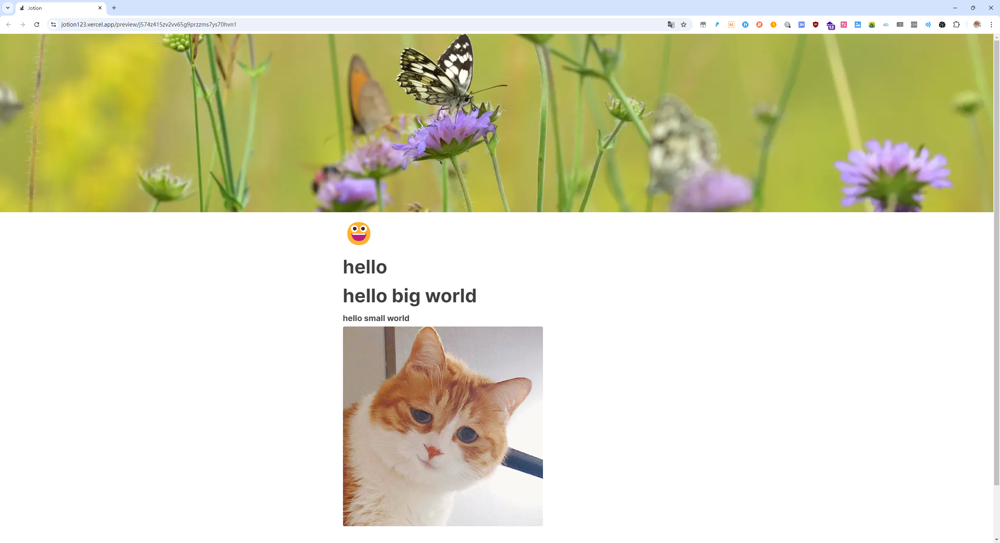

# Jotion

### 简介

### 技术栈介绍

框架：next.js14

ui 库：shadcn

状态管理：zustand

认证登录：[clerk](https://clerk.com/)

数据库：[convex](https://www.convex.dev/)

图片存储：[edgestore](https://edgestore.dev/)

### 参考代码

https://github.com/loneknight9/notion-clone-tutorial

https://github.com/paperplane110/notion-clone

### 部署

我自己是部署在 vercel，基本没什么问题，唯一要注意的是 convex，请参考

https://docs.convex.dev/production/hosting/vercel

### 其他

跟着教程做下来基本没什么问题，唯一要注意的是 BlockNoteEditor 有些更新，请参考https://github.com/paperplane110/notion-clone/blob/main/components/editor.tsx

或者看一下<https://www.bilibili.com/video/BV1ov411F7BX>的评论区。
